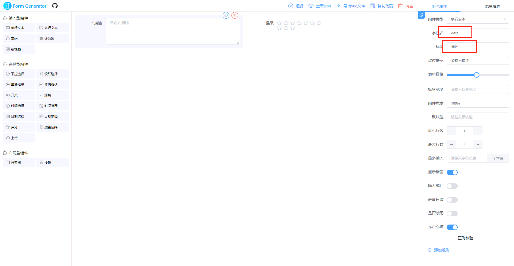
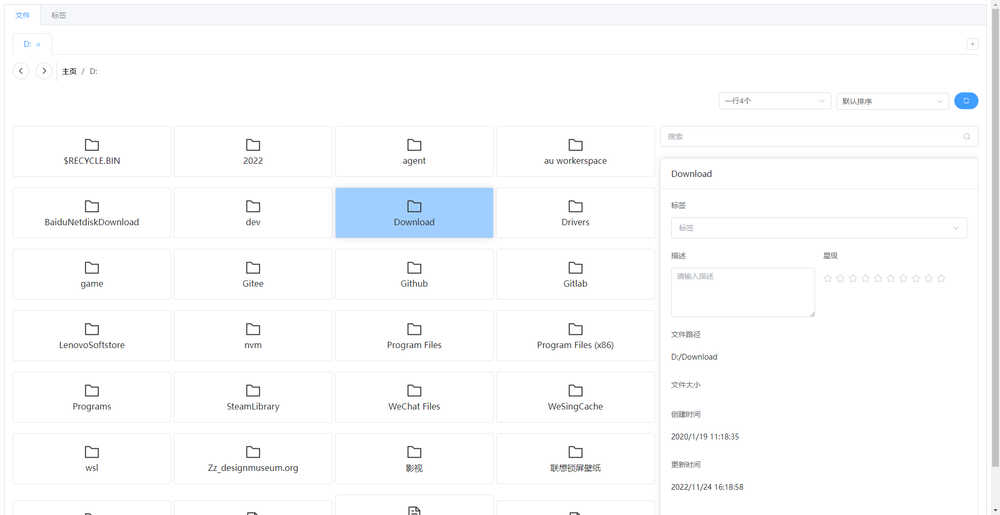
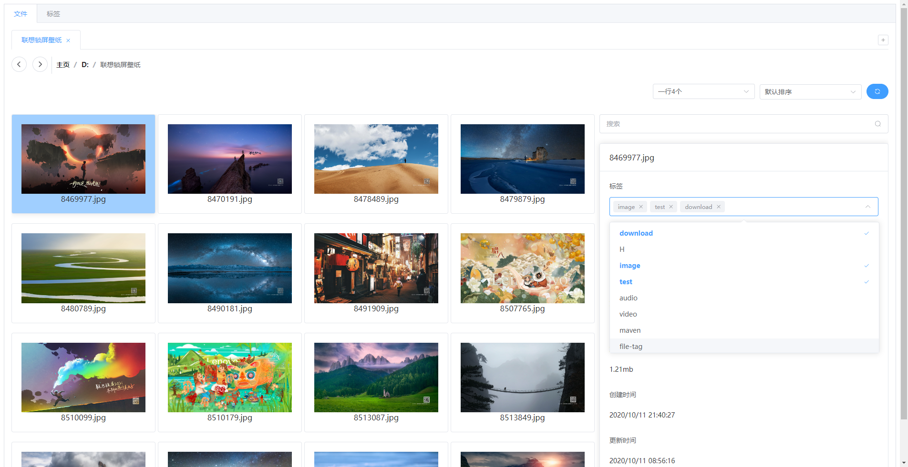
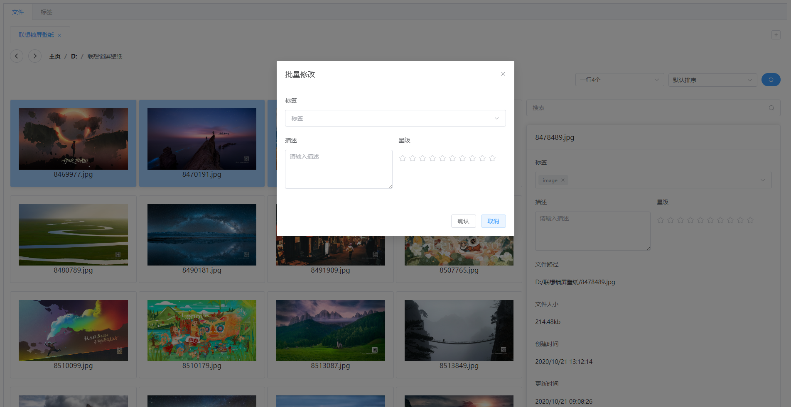
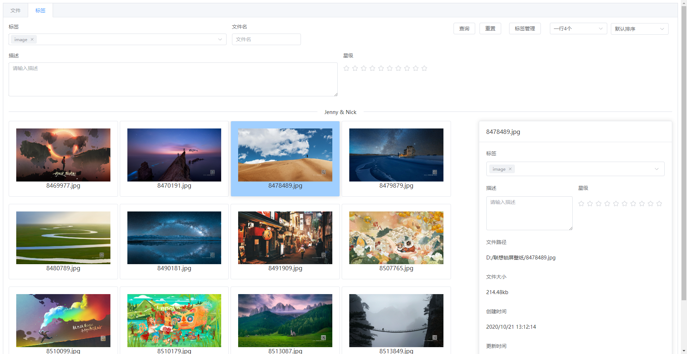
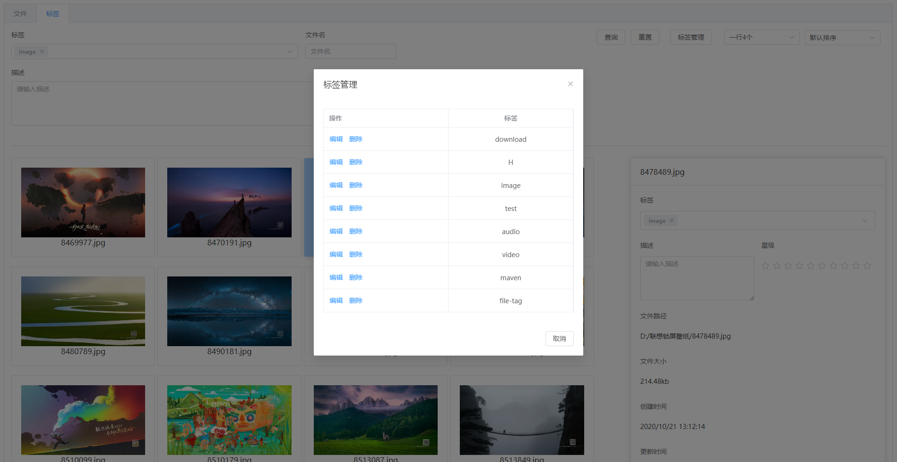

# 本地文件标签管理工具

## 功能介绍

通过对文件设置标签,建立跨文件夹的文件管理体系,通过标签搜索高效管理/使用本地文件.支持:

1. 文件可视化管理,方便查看文件标签/文件路径/文件大小/创建时间/更新时间
2. 单个文件添加标签,单个文件可添加多个标签,输入时支持标签联想
3. 多文件批量添加标签(通过右键菜单实现)
4. 标签管理
5. 文件夹内,文件名和标签搜索
6. 全局标签搜索
7. 文件重命名/复制/移动/删除/在文件浏览器中打开等操作
8. 按默认排序(文件类型,文件名)/更新时间/创建时间排序,浏览文件
9. 自定义单行文件显示数量
10. 导入导出Excel,json文件,方便备份数据,或导入其他电脑
11. 可以给文件添加自定义数据,根据部分自定义数据搜索,以及导入导出也会增加自定义的数据

注意事项:

> 目前仅支持window系统
>
> 关闭工具时会自动保存操作数据,但保险起见也可手动 Ctrl+s 保存

## 使用的技术

使用了vue3,electron,element-plus组价库

## 如何添加自定义数据

可以在下面网页定义好表单,需要确定好字段名和标题.然后点击查看json,将json保存到`C:\Users\用户名\file_tag_config`的`custom_form.json`文件中.然后在工具中按`ctrl+r`刷新工具,就可以刷新自定义的表单了.

> 目前工具支持大部分组件,除编辑器,另外上传和按钮虽然能显示,但在我的工具中并不支持,所已不要采用这些组件.
>
> 组件属性，表单属性也并非全部支持，比如正则校验，必填等。

[form-generator (gitee.io)](https://mrhj.gitee.io/form-generator/#/)

## 工具截图

###### 文件打标签

###### 多选,右键批量修改

###### 搜索

> 多个标签之间是并且关系

 

 

######  标签管理

