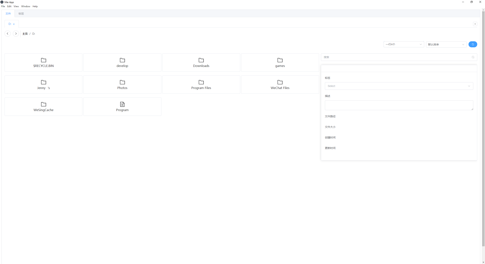
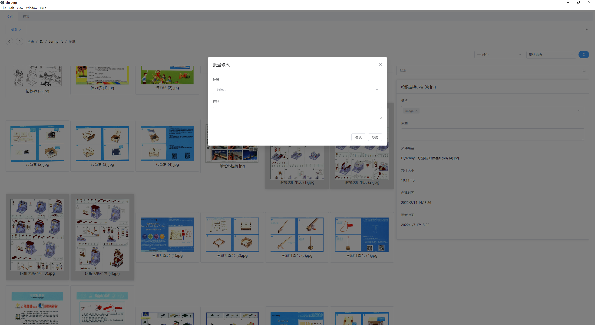
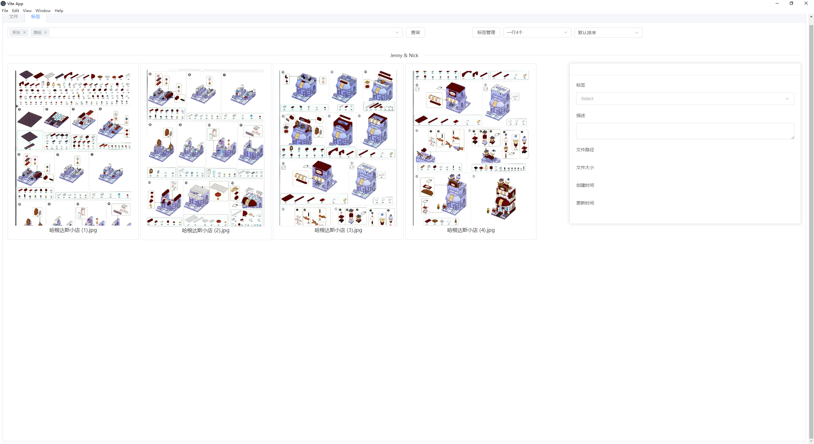
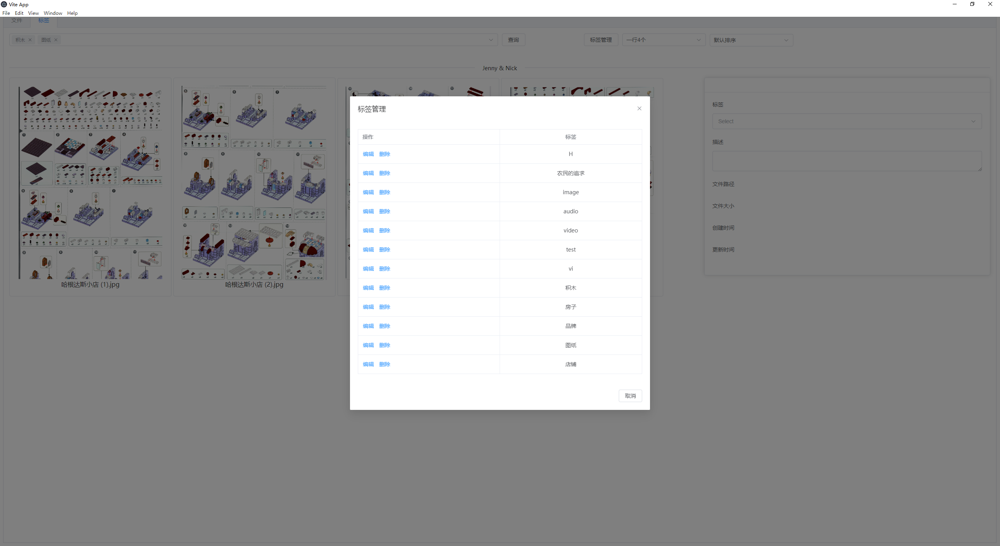

# 本地文件标签管理工具

## 功能介绍

通过对文件设置标签/添加描述,建立跨文件夹的文件管理体系,通过标签搜索高效管理/使用本地文件.支持:

1. 文件可视化管理,方便查看文件标签/描述/文件路径/文件大小/创建时间/更新时间
2. 单个文件添加标签和描述,单个文件可添加多个标签,输入时支持标签联想
3. 多文件批量添加标签/描述(通过右键菜单实现)
4. 标签管理
5. 文件夹内,文件名和标签聚合搜索
6. 全局,标签搜索
7. 文件重命名/复制/移动/删除/在文件浏览器中打开等操作
8. 按默认排序(文件类型,文件名)/更新时间/创建时间排序,浏览文件
9. 自定义单行文件显示数量

注意事项:

> 目前仅支持window系统
>
> 关闭工具时会自动保存操作数据,但保险起见也可手动 Ctrl+s 保存

## 使用的技术

使用了vue3,TypeScript,electron,element-plus等技术

## 工具截图

文件打标签:

多选,右键批量修改

标签搜索(多个标签之间是并且关系)

标签管理

## 

## 
